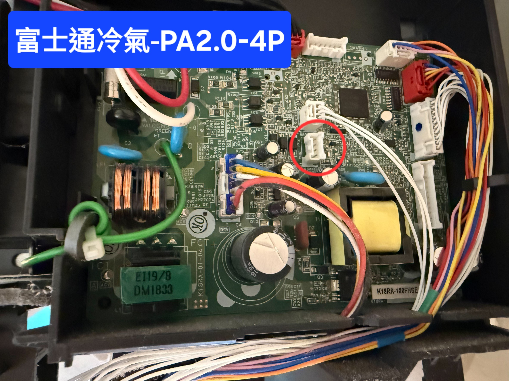
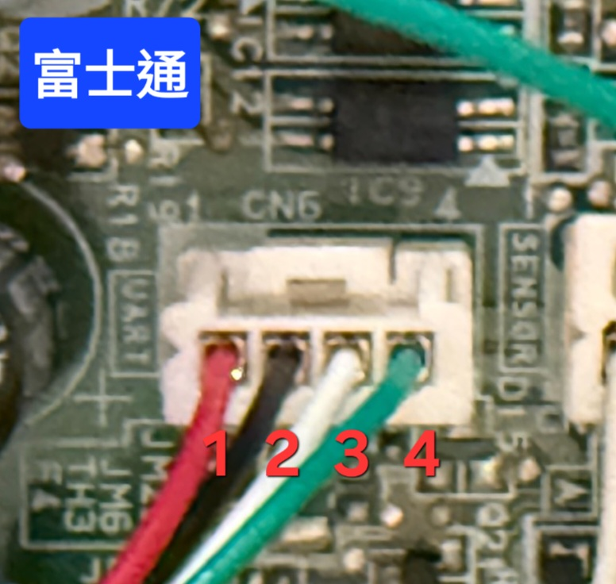

# FujitsuAC ESPHome

This project is built upon the excellent open-source work of [Benas09](https://github.com/Benas09). Special thanks to him for developing the [FujitsuAC](https://github.com/Benas09/FujitsuAC) Arduino library, which reverse-engineered the Fujitsu AC UART protocol and made this project possible.

本專案建立在 [Benas09](https://github.com/Benas09) 出色的開源工作之上。感謝他開發 [FujitsuAC](https://github.com/Benas09/FujitsuAC) Arduino 程式庫，深入解析富士通冷氣的 UART 通訊協定，使本專案得以實現。

---

本專案以 AI 輔助將 [FujitsuAC](https://github.com/Benas09/FujitsuAC) 轉換為 ESPHome 的 custom component，讓你無需雲端服務，即可透過 ESP32 搭配 ESPHome 接入 Home Assistant 本地控制富士通空調。

---

## ⚠️ 重要安全警告

**請勿將冷氣接腳直接連接至任何外部設備（如電腦）。**

冷氣的接腳電壓並非相對於大地 GND，若不小心將冷氣 GND 與筆電 GND 接觸，可能導致：
- 筆電 USB 埠永久損毀
- 冷氣主板保險絲燒斷

操作前請務必確認電氣隔離，並使用適當的電平轉換模組。

---

## 硬體需求

| 零件 | 說明 |
|------|------|
| DC/DC 降壓模組（12V → 5V） | **請選購 5V 輸出版本**，電壓選錯將燒毀冷氣 UART 介面 |
| ESP32 模組 | ESP32、ESP32-C3、ESP32-S3 皆相容 |
| JST PAP-4 連接器（PA-2.0mm-4P） | 對應冷氣端 UTY-TFSXW1 的 4-pin 接頭 |
| 5V → 3.3V 電平轉換模組 | 強烈建議使用，可有效防止 ESP 模組損毀 |

---

## 支援型號

下圖為高級系列 (ASCGXXXKGTA)的接頭位置:



📌 **注意**：其他系列有可能沒有白色公座，需要自行焊接拉線!! 已知Nocria Z系列無插座

新款KGTB系列有內建模組，需拆除改接此模組才行!


---

## 接線方式

接頭近照:



```
冷氣插座          DC/DC 降壓模組（12V → 5V）   ESP32
Pin 1 (+12V)  →  Vin+  →  Vout+  ─────────→  5V
Pin 2 (GND)   →  Vin-  →  Vout-  ─────────→  GND
Pin 3 (DATA)  ──────────────────────────────→  RX / GPIO16（冷氣 → ESP）
Pin 4 (DATA)  ──────────────────────────────→  TX / GPIO17（ESP → 冷氣）
```


---

## 支援功能

| 功能 | 說明 |
|------|------|
| 開關 | 電源 On / Off |
| 運轉模式 | Auto / Cool / Heat / Dry / Fan |
| 目標溫度 | 16～30°C（步進 0.5°C；Heating 最低 16°C，其他模式最低 18°C） |
| 風速 | Auto / Quiet / Low / Medium / High |
| 垂直風向 | 位置 1～6 + Swing 自動擺風 |
| 水平風向 | 位置 1～6 + Swing 自動擺風（需機型支援） |
| 室內溫度回報 | ActualTemp 暫存器，解析度 0.1°C |
| 室外溫度回報 | OutdoorTemp 暫存器，解析度 0.1°C |

---

## 參考資料

- 原始 Arduino 程式庫：[github.com/Benas09/FujitsuAC](https://github.com/Benas09/FujitsuAC)
- ESPHome Climate 元件文件：[esphome.io/components/climate/](https://esphome.io/components/climate/)
- 感謝Hata協助測試與提供照片
